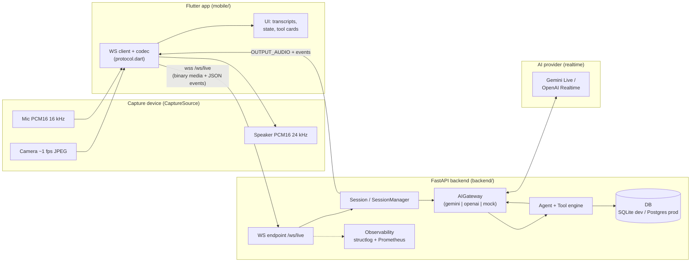
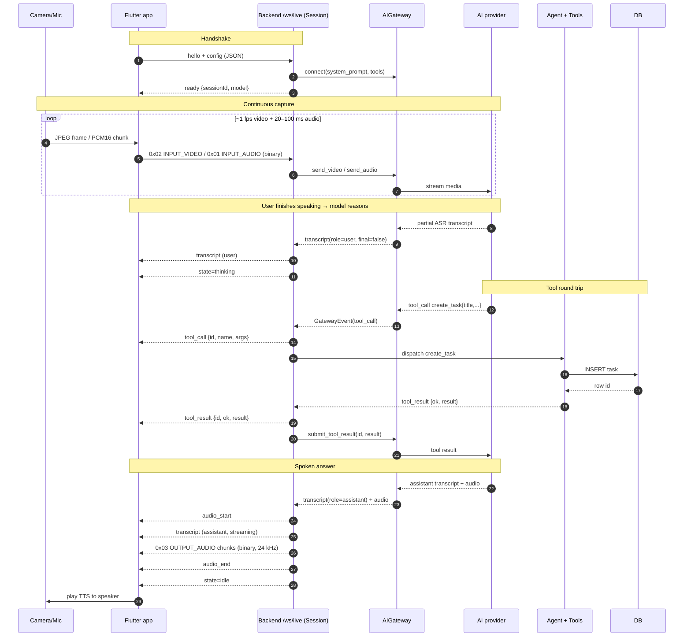
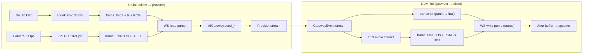
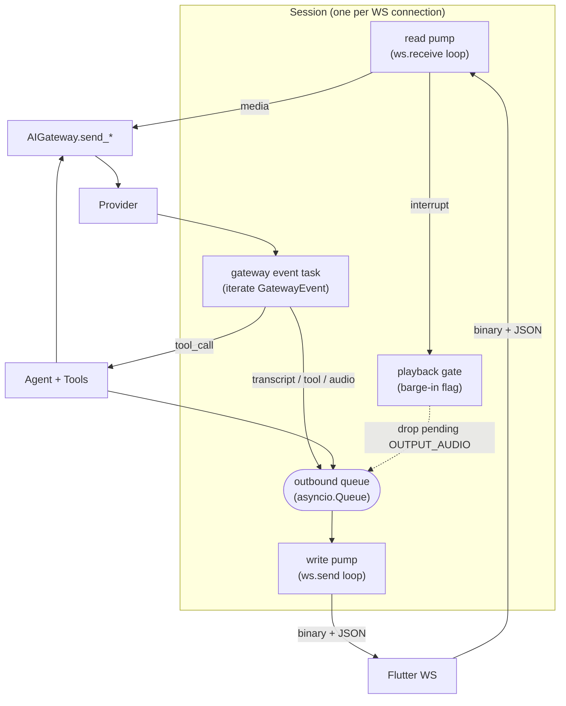
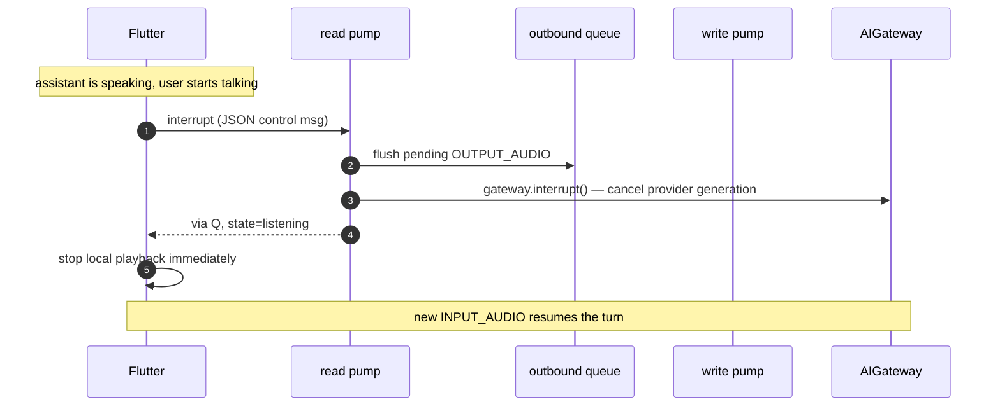
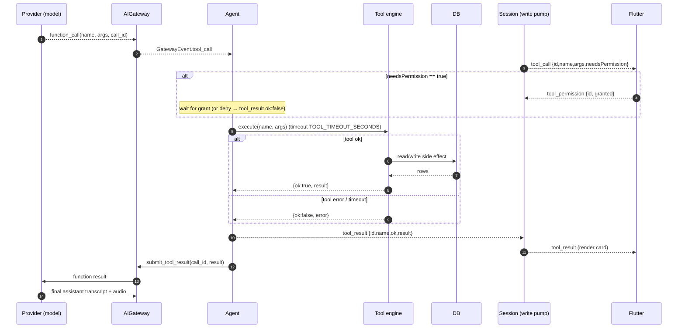
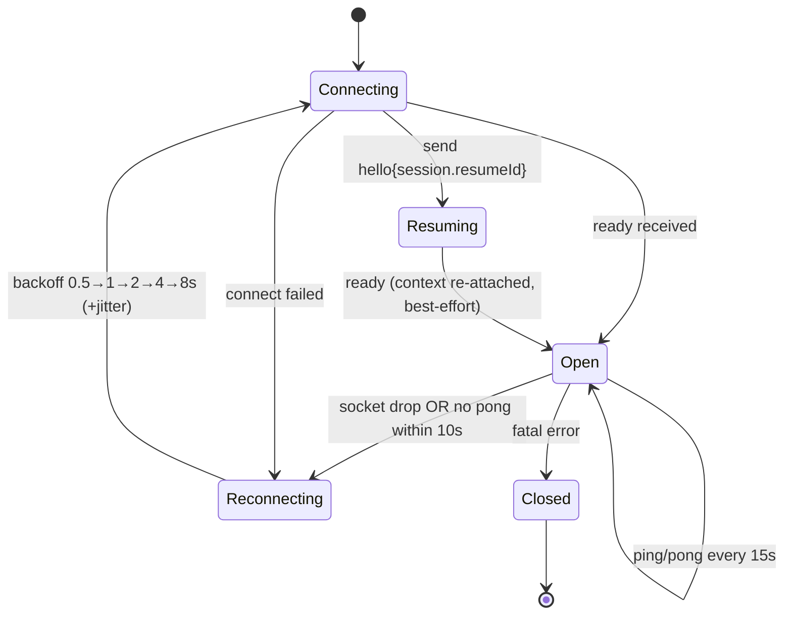

# FarryOn — Architecture

> Real-time multimodal AI assistant: stream **camera + microphone** to an AI that
> **sees, listens, talks back, and takes actions**. Phone today, smart glasses
> tomorrow.
>
> This document is the system-level map. The **authoritative wire contract** is
> [`PROTOCOL.md`](../PROTOCOL.md); everything below conforms to it. Where this
> doc and `PROTOCOL.md` disagree, `PROTOCOL.md` wins.

**Audience:** a senior engineer onboarding to the repo.

---

## 1. System at a glance

FarryOn is three cooperating tiers connected by **one full-duplex WebSocket**
(`/ws/live`) and a **pluggable AI gateway**:

1. **Flutter app** (`mobile/`) — captures audio + video, plays TTS, renders
   transcripts and tool activity. Talks only to the backend, never to an AI
   provider directly.
2. **FastAPI backend** (`backend/`) — terminates the WebSocket, mediates the AI
   provider, runs the agent + tool engine, persists state, exports metrics.
3. **AI provider** — Gemini Live **or** OpenAI Realtime (plus a `mock`), behind a
   single `AIGateway` interface so the rest of the system is provider-agnostic.



**Design principles**

- **One socket, two frame kinds.** Text frames = JSON control/events; binary
  frames = media with a 9-byte header (`PROTOCOL.md` §2). No second channel.
- **The backend is the trust + policy boundary.** Provider keys, tool execution,
  persistence, and auth live server-side. The client holds no secrets.
- **Provider-agnostic core.** Swap Gemini ⇄ OpenAI ⇄ mock via one env var
  (`AI_PROVIDER`) with zero protocol or client changes.
- **Device-agnostic capture.** A `CaptureSource` abstraction (see
  [`DEVICE_ADAPTER.md`](./DEVICE_ADAPTER.md)) means the backend cannot tell a
  phone from glasses; it only sees the wire protocol.

---

## 2. Component breakdown

### 2.1 Flutter app (`mobile/`)

| Concern            | Responsibility                                                                 |
| ------------------ | ------------------------------------------------------------------------------ |
| **CaptureSource**  | Abstracts the device: `audio16k` stream, `jpegFrames` stream, device info.     |
| **WS client**      | Single connection to `wss://<host>/ws/live?token=<jwt>`; read + write pumps.    |
| **Codec**          | Encodes/decodes binary frames (tags `0x01/0x02/0x03`) per `protocol.dart`.     |
| **Playback**       | Buffers and plays streamed `OUTPUT_AUDIO` (PCM16 @ 24 kHz) at low latency.      |
| **UI / state**     | Renders `transcript`, `state` (idle/listening/thinking/speaking), tool cards.  |
| **Reconnect**      | Heartbeat (`ping`/`pong`), exponential backoff, `hello` with `resumeId`.       |

`mobile/lib/protocol/protocol.dart` is the Dart mirror of `PROTOCOL.md`:
`FrameTag`, `AudioFormat` (16 kHz mic / 24 kHz TTS), `VideoFormat`, `MsgType`,
`ToolName`, `LiveState`. The app never hard-codes magic numbers.

### 2.2 WebSocket layer (backend)

The endpoint `/ws/live` accepts the upgrade, validates the optional `?token=`
JWT (enforced only when `JWT_SECRET` is non-default — see `config.py`
`auth_enabled`), then hands the socket to a **`Session`**. Each connection gets
exactly one `Session` running two cooperating asyncio tasks ("pumps"):

- **read pump** — `for await frame in ws`: classify text vs binary, parse, route.
- **write pump** — drains an outbound `asyncio.Queue` of JSON events and
  `OUTPUT_AUDIO` chunks back to the client.

See §5 for the concurrency model.

### 2.3 AI Gateway (`AIGateway` interface)

A thin, **provider-agnostic** async interface. Conceptual surface:

```python
class AIGateway(Protocol):
    async def connect(self, *, system_prompt: str, tools: list[ToolSpec]) -> None: ...
    async def send_audio(self, pcm16_16k: bytes) -> None: ...   # from INPUT_AUDIO
    async def send_video(self, jpeg: bytes) -> None: ...        # from INPUT_VIDEO
    async def send_text(self, text: str) -> None: ...           # typed input
    async def interrupt(self) -> None: ...                      # barge-in
    async def submit_tool_result(self, call_id: str, result: dict) -> None: ...
    def events(self) -> AsyncIterator[GatewayEvent]: ...        # transcripts, audio,
                                                                # tool_call, turn end
    async def close(self) -> None: ...
```

Implementations:

| Adapter  | Upstream                                   | Notes                                               |
| -------- | ------------------------------------------ | --------------------------------------------------- |
| `gemini` | Gemini Live API (`gemini-2.0-flash-live-001`) | Bidirectional streaming; native audio in/out + tools. |
| `openai` | OpenAI Realtime (`gpt-4o-realtime-preview`)   | Realtime events; resample TTS to 24 kHz if needed.  |
| `mock`   | In-process fake                            | Deterministic; used by CI/tests, **no API key**.    |

Selected by `AI_PROVIDER` (`config.py`). The gateway **normalizes** each
provider's event stream into FarryOn `GatewayEvent`s so the `Session` and agent
never branch on the provider. Provider-native sample rates are normalized to the
contract (16 kHz in, 24 kHz out).

### 2.4 Agent + Tool engine

The **agent** owns the tool-calling loop. When the gateway surfaces a tool call,
the agent dispatches it to the **tool engine**, which holds a registry of exactly
the four tools in `PROTOCOL.md` §5:

| Tool            | Params (required)            | Effect                                  |
| --------------- | ---------------------------- | --------------------------------------- |
| `create_note`   | `text`                       | Persist a note row.                     |
| `web_search`    | `query`                      | Query the web-search provider.          |
| `create_task`   | `title` (+ optional `due_date` ISO-8601) | Persist a to-do task.       |
| `send_message`  | `contact`, `text`            | Send a message to a known contact.      |

Each tool is an async callable with a JSON-schema signature, executed under a
timeout (`TOOL_TIMEOUT_SECONDS`, default 20s). Results are fed back to the model
via `submit_tool_result`; the UI sees `tool_call` / `tool_result` events. Full
pipeline in §7.

### 2.5 Persistence (DB)

Async SQLAlchemy over `DATABASE_URL`:

- **dev/CI:** `sqlite+aiosqlite:///./farryon.db`
- **prod:** `postgresql+asyncpg://...`

Stores sessions (for `resumeId` re-attach), transcripts, and tool side-effects
(notes, tasks, messages, search history). Schema is owned by `backend/`; this
doc only states the contract that **tool side-effects and session metadata are
durable**.

### 2.6 Observability

- **Logging:** `structlog` JSON to stdout (`logging_conf.py`), one line per
  event, correlated by `session_id`. Ships cleanly to any aggregator.
- **Metrics:** Prometheus `/metrics` (latency histograms, active sessions, tool
  call counts/errors, gateway reconnects). Scraped by Prometheus; visualized in
  Grafana. See [`DEPLOYMENT.md`](./DEPLOYMENT.md) §8.
- **Health:** `/healthz` (liveness) and `/readyz` (readiness incl. DB ping).

### 2.7 Device adapter

The universal capture seam (`CaptureSource`) lets a phone, smart glasses, or an
external camera feed the same wire protocol. The backend stays oblivious — it
only reads the `device` block in `hello` for telemetry. Detail in
[`DEVICE_ADAPTER.md`](./DEVICE_ADAPTER.md).

---

## 3. End-to-end data flow (Camera → WS → AI → Agent → AI → Flutter)

One voice+vision turn that triggers a tool, end to end. Frame-level binary tags
and JSON shapes are in [`DATA_FLOW.md`](./DATA_FLOW.md); this is the component view.



**Path summary:** `Camera/Mic → Flutter codec → binary frames → WS read pump →
AIGateway → provider`. Provider emits transcripts/tool-calls/audio →
`AIGateway` normalizes → `Session` fans out JSON events + `OUTPUT_AUDIO` via the
write pump → Flutter renders text + plays audio. Tool calls detour through the
**Agent + Tools → DB** and loop back into the provider before the spoken answer.

---

## 4. Realtime streaming pipeline

Latency is the product. The pipeline is **fully streaming** in both directions —
nothing waits for a complete utterance to start flowing.



Key properties:

- **Small chunks.** INPUT_AUDIO is sent in 20–100 ms slices (320–1600 samples @
  16 kHz); OUTPUT_AUDIO comes back in similar slices so the speaker can start
  almost immediately (`PROTOCOL.md` §2, §8).
- **Video is sparse.** ~1 fps, downscaled ≤ 1024 px. Only the **latest** frame
  is meaningful; frames are never buffered across a reconnect.
- **Partial transcripts.** `transcript` events stream with `final:false` then a
  `final:true`, so the UI shows live captions for both user ASR and assistant.
- **State signaling.** `state` transitions (`idle → listening → thinking →
  speaking → idle`) drive UI affordances without the client inferring anything.
- **Backpressure.** The outbound queue is bounded. If the client is slow,
  `OUTPUT_AUDIO` is the first to be dropped/coalesced (it's regenerable on the
  next turn); control/JSON events are preserved.

---

## 5. Concurrency model (read/write pumps, barge-in)

Each WebSocket connection is one `Session` driven by **two asyncio tasks** plus a
**gateway event task**, coordinated through queues. This avoids head-of-line
blocking between "receiving the user" and "speaking back."



**Pumps**

- **Read pump:** the only reader of the socket. Demultiplexes by frame type
  (binary header tag vs JSON `type`), forwards media to the gateway, applies
  control messages (`audio_start/stop`, `text`, `interrupt`, `tool_permission`,
  `ping`).
- **Write pump:** the only writer of the socket. Serializes access so JSON events
  and `OUTPUT_AUDIO` binary frames never interleave mid-frame. Reads from the
  bounded outbound queue.
- **Gateway event task:** consumes the provider's normalized event stream;
  enqueues transcripts/audio for the write pump and routes `tool_call`s to the
  agent.

This **single-reader / single-writer** discipline means no lock is needed around
the socket; the queue is the synchronization point.

**Barge-in (interrupt)**

The user can talk over the assistant. The flow:



On `interrupt`: the read pump (a) **flushes queued `OUTPUT_AUDIO`** so no stale
speech plays, (b) calls `gateway.interrupt()` to cancel the in-flight provider
generation, and (c) the client stops local playback the instant it emits the
message (it does not wait for the server). The session returns to `listening`.

**Concurrency invariants**

- One reader, one writer per socket.
- Media uplink is fire-and-forget; never blocks on tool execution.
- Tool execution runs in the gateway-event task path with a timeout, so a slow
  tool can't stall media ingest.
- Per-connection state is isolated; horizontal scale is "more sessions, more
  workers" (see [`DEPLOYMENT.md`](./DEPLOYMENT.md) §4 for sticky sessions/Redis).

---

## 6. Tool-calling pipeline



**Notes**

- **Exactly four tools** are registered (`create_note`, `web_search`,
  `create_task`, `send_message`); names and params match `PROTOCOL.md` §5
  verbatim. Unknown tool names are rejected with a `tool_result {ok:false}`.
- **Optional permission gate.** When a tool is marked `needsPermission:true`
  (policy-driven, e.g. `send_message`), the backend waits for
  `tool_permission {granted}` before executing. Denied → `tool_result {ok:false,
  error:"permission_denied"}` is returned to both the UI and the model.
- **Parallel tool calls** (if a provider emits several at once) are dispatched
  concurrently and each produces its own `tool_call`/`tool_result` pair keyed by
  `id`.
- **Routing guidance** for the model (when to call which tool) lives in
  [`PROMPTS.md`](./PROMPTS.md).

---

## 7. Error handling & reconnection strategy

### 7.1 Error taxonomy

| Class                    | Example                                    | Handling                                                                 |
| ------------------------ | ------------------------------------------ | ------------------------------------------------------------------------ |
| **Client protocol error**| bad binary header, unknown `type`          | `error {code, message, fatal:false}`; frame dropped, session continues.  |
| **Auth failure**         | invalid/expired `?token=`                  | Close with `error {code:"unauthorized", fatal:true}` (when auth enabled).|
| **Provider transient**   | gateway socket dropped, rate limit         | Backend retries the gateway; surfaces `state` and a non-fatal `error`.   |
| **Provider fatal**       | model/config invalid                       | `error {fatal:true}`; session closed; client reconnects fresh.           |
| **Tool error / timeout** | web search 5xx, >`TOOL_TIMEOUT_SECONDS`    | `tool_result {ok:false, error}`; model is told and can recover verbally. |
| **Backpressure**         | client too slow to drain audio             | Coalesce/drop `OUTPUT_AUDIO`; preserve JSON events.                      |

Errors are **structured**: every `error` event carries `code`, human-readable
`message`, and `fatal`. Non-fatal errors keep the session alive; fatal errors
close the socket and rely on client reconnect.

### 7.2 Reconnection (client-driven, per `PROTOCOL.md` §7)



- **Heartbeat:** client sends `ping` every **15 s**; if no `pong` within **10 s**,
  it drops and reconnects.
- **Backoff:** exponential with jitter — **0.5s, 1s, 2s, 4s, 8s (max)** — reset on
  a successful `ready`.
- **Resume:** on reconnect the client sends `hello` with `session.resumeId`; the
  backend re-attaches durable context **best-effort** (the realtime provider
  session may start fresh — transcripts/tool history persist in the DB even if
  the live model context does not).
- **No stale media.** Audio/video captured during a drop is **discarded, not
  buffered** — only the latest video frame matters (`PROTOCOL.md` §7). This keeps
  the model from reasoning over seconds-old context.

### 7.3 Server-side resilience

- **Idempotent tool side-effects where feasible**, so a retried turn after a
  reconnect doesn't double-create.
- **Per-session cancellation:** closing a socket cancels its pumps, gateway
  connection, and any in-flight tool tasks (structured concurrency / task group).
- **Graceful shutdown:** on SIGTERM the backend stops accepting new sockets,
  drains in-flight turns briefly, then closes — clients reconnect to another
  worker (see [`DEPLOYMENT.md`](./DEPLOYMENT.md) rollout/runbook).

---

## 8. Cross-references

| Topic                                   | Document                                     |
| --------------------------------------- | -------------------------------------------- |
| Wire contract (messages, tags, tools)   | [`PROTOCOL.md`](../PROTOCOL.md)              |
| Frame-level walkthrough of one turn     | [`DATA_FLOW.md`](./DATA_FLOW.md)             |
| System prompt + tool-routing prompts    | [`PROMPTS.md`](./PROMPTS.md)                 |
| Deploy, scaling, observability, runbook | [`DEPLOYMENT.md`](./DEPLOYMENT.md)           |
| Universal capture device adapter        | [`DEVICE_ADAPTER.md`](./DEVICE_ADAPTER.md)   |
