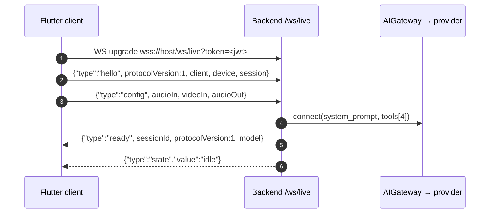
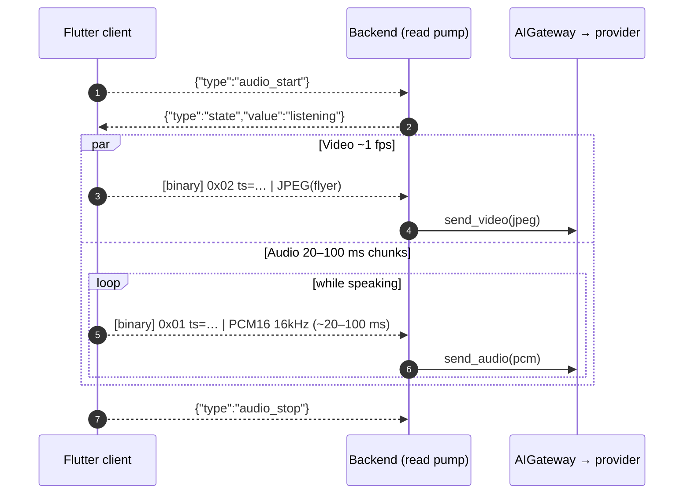
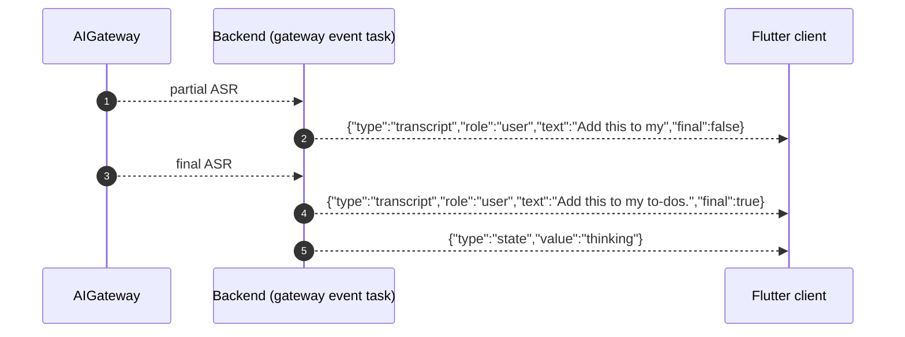
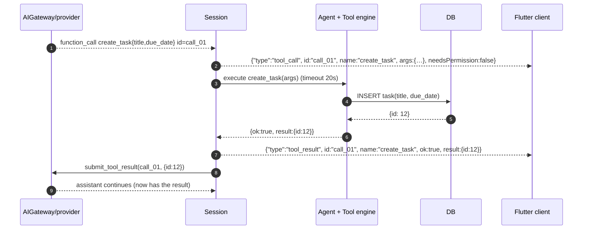
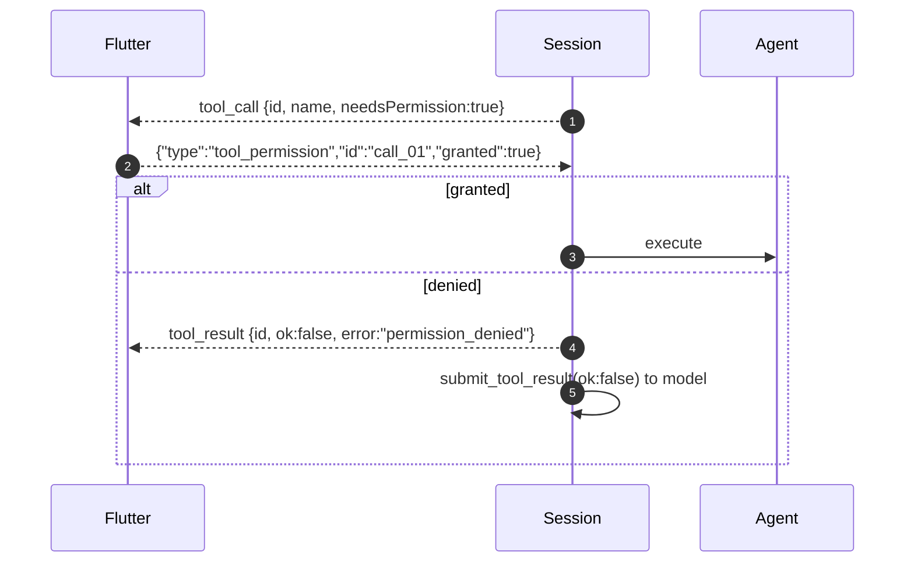
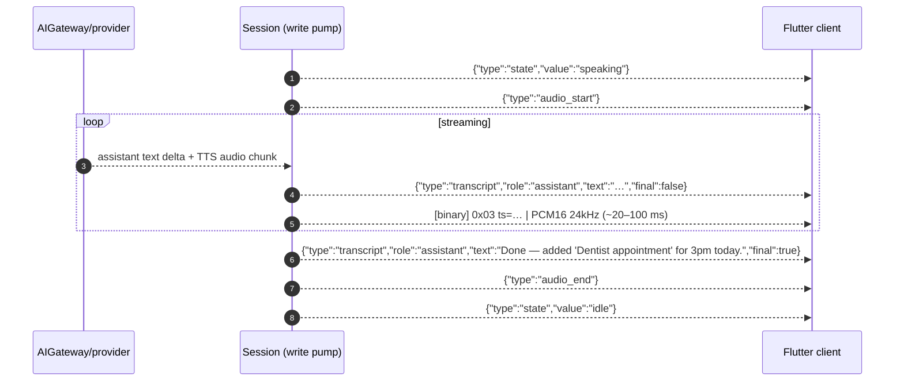

# FarryOn — Data Flow (frame-level walkthrough)

> A byte-and-message level trace of **one voice + vision turn that triggers a
> tool**, using the exact binary tags and JSON messages from
> [`PROTOCOL.md`](../PROTOCOL.md). For the component-level view see
> [`ARCHITECTURE.md`](./ARCHITECTURE.md).

Every literal below (tags `0x01/0x02/0x03`, message `type`s, tool names, sample
rates) is taken verbatim from the contract. If you change a shape, change
`PROTOCOL.md` first.

---

## 0. Notation

- **`[binary] tag=0xNN ts=<ms> | <payload>`** — a WebSocket **binary** frame: a
  1-byte tag, an 8-byte little-endian `uint64` timestamp (ms since epoch), then
  the raw payload (`PROTOCOL.md` §2). WebSocket frames are length-delimited, so
  there is no length field.
- **`{ ... }`** — a WebSocket **text** frame carrying UTF-8 JSON with a `type`
  discriminator.
- Direction is shown as **C→S** (client→server) or **S→C** (server→client).

Binary tag table (`PROTOCOL.md` §2):

| tag    | name         | direction | payload                            |
| ------ | ------------ | --------- | ---------------------------------- |
| `0x01` | INPUT_AUDIO  | C→S       | PCM signed-16 LE, **16 kHz** mono  |
| `0x02` | INPUT_VIDEO  | C→S       | JPEG single frame (~1 fps)         |
| `0x03` | OUTPUT_AUDIO | S→C       | PCM signed-16 LE, **24 kHz** mono  |

---

## 1. The scenario

> The user points the camera at a flyer for a 3pm dentist appointment and says
> *"Add this to my to-dos."* FarryOn reads the flyer, calls `create_task`, then
> speaks a confirmation.

This exercises **vision + voice input, a tool round trip, and streamed TTS
output** — the full loop.

---

## 2. Phase A — Connection & handshake



**A1 — `hello` (C→S).** Sent once, immediately after the socket opens:

```json
{ "type": "hello",
  "protocolVersion": 1,
  "client": { "platform": "android", "appVersion": "1.0.0" },
  "device": { "kind": "phone", "id": "pixel-8-abc",
              "capabilities": ["audio_in", "video_in", "audio_out"] },
  "session": { "resumeId": null } }
```

**A2 — `config` (C→S).** Declares the media formats (these MUST match the binary
streams the client will actually send):

```json
{ "type": "config",
  "audioIn":  { "encoding": "pcm16", "sampleRate": 16000, "channels": 1 },
  "videoIn":  { "format": "jpeg", "fps": 1, "maxWidth": 1024 },
  "audioOut": { "encoding": "pcm16", "sampleRate": 24000, "channels": 1 } }
```

**A3 — `ready` (S→C).** The backend has opened the gateway and registered the
four tools:

```json
{ "type": "ready", "sessionId": "5e3a…", "protocolVersion": 1,
  "model": "gemini-live" }
```

The client checks `protocolVersion` against its `kProtocolVersion` (= 1). On
mismatch it surfaces an upgrade prompt rather than streaming garbage. The backend
also emits `{"type":"state","value":"idle"}`.

---

## 3. Phase B — Capturing the turn (continuous binary uplink)

The user holds up the flyer and speaks. Two binary streams flow **concurrently**;
the client also brackets speech with `audio_start` / `audio_stop`.



**B1 — `audio_start` (C→S).** `{ "type": "audio_start" }` — mic opened / user
begins speaking. Backend transitions to `state=listening`.

**B2 — INPUT_VIDEO frame (C→S, binary).** One JPEG of the flyer, downscaled
≤ 1024 px:

```
[binary] tag=0x02 ts=1718764800123 | <JPEG bytes of the flyer>
```

The read pump strips the 9-byte header and calls `gateway.send_video(jpeg)`. At
~1 fps only the **latest** frame matters; older frames are superseded.

**B3 — INPUT_AUDIO frames (C→S, binary, repeated).** The utterance is streamed in
20–100 ms PCM16 chunks (320–1600 samples @ 16 kHz):

```
[binary] tag=0x01 ts=1718764800140 | <PCM16 ~20 ms>
[binary] tag=0x01 ts=1718764800160 | <PCM16 ~20 ms>
…
```

Each becomes `gateway.send_audio(pcm)`. Uplink is **fire-and-forget** — it never
blocks on downstream reasoning or tool execution.

**B4 — `audio_stop` (C→S).** `{ "type": "audio_stop" }` — mic closed. (With
server-side VAD the provider may also detect end-of-speech on its own; the
explicit message is authoritative for the client's intent.)

> **Typed alternative:** instead of B1–B4 the client may send
> `{ "type": "text", "text": "Add the flyer event to my to-dos" }`. The video
> stream still provides the visual context.

---

## 4. Phase C — ASR transcript & reasoning

The provider performs ASR and reasons over the audio + the latest video frame.



**C1 — partial user transcript (S→C).**

```json
{ "type": "transcript", "role": "user", "text": "Add this to my", "final": false }
```

**C2 — final user transcript (S→C).**

```json
{ "type": "transcript", "role": "user", "text": "Add this to my to-dos.", "final": true }
```

**C3 — `state=thinking` (S→C).** `{ "type": "state", "value": "thinking" }`. The
model now decides it needs the `create_task` tool.

---

## 5. Phase D — Tool round trip (`create_task`)

This is the heart of the agentic loop (`PROTOCOL.md` §5 tool-call loop). The
model emits a tool call → backend executes it → backend feeds the result back →
model produces the final answer.



**D1 — model emits the tool call.** The gateway normalizes it to a FarryOn
`tool_call` event; the backend forwards it to the UI:

```json
{ "type": "tool_call", "id": "call_01", "name": "create_task",
  "args": { "title": "Dentist appointment", "due_date": "2026-06-19T15:00:00" },
  "needsPermission": false }
```

> Schema check: `create_task` requires `title`; `due_date` is optional ISO-8601
> (`PROTOCOL.md` §5). The values came from the model reading the flyer.

**D2 — backend executes the tool.** The agent dispatches to the tool engine,
which inserts a task row under the `TOOL_TIMEOUT_SECONDS` (20s) timeout.

**D3 — `tool_result` to the UI (S→C).** For display (a tool card):

```json
{ "type": "tool_result", "id": "call_01", "name": "create_task",
  "ok": true, "result": { "id": 12 } }
```

**D4 — result back to the model.** `gateway.submit_tool_result("call_01", {"id":
12})`. The model now has confirmation the task was saved and can compose its
spoken reply.

### 5.1 Optional permission gate

If policy marks the tool `needsPermission:true` (e.g. `send_message`), D1 is
followed by a wait:



---

## 6. Phase E — Streamed spoken answer (TTS downlink)

The model produces the final answer as a streamed assistant transcript **and**
streamed OUTPUT_AUDIO. The client shows captions and plays audio with minimal
latency.



**E1 — `state=speaking` (S→C).** `{ "type": "state", "value": "speaking" }`.

**E2 — `audio_start` (S→C).** `{ "type": "audio_start" }` — server is about to
send OUTPUT_AUDIO binary frames. (Note: `audio_start` is reused server→client to
mean "assistant begins speaking.")

**E3 — assistant transcript deltas (S→C).** Streamed captions:

```json
{ "type": "transcript", "role": "assistant", "text": "Done — added ", "final": false }
```

**E4 — OUTPUT_AUDIO frames (S→C, binary, repeated).** TTS streamed at **24 kHz**:

```
[binary] tag=0x03 ts=1718764801010 | <PCM16 24kHz ~20 ms>
[binary] tag=0x03 ts=1718764801030 | <PCM16 24kHz ~20 ms>
…
```

The client feeds these into a jitter buffer and plays them through the speaker
(or glasses audio out). It must resample/route to its output device but the wire
rate is fixed at 24 kHz.

**E5 — final assistant transcript (S→C).**

```json
{ "type": "transcript", "role": "assistant",
  "text": "Done — added 'Dentist appointment' for 3pm today.", "final": true }
```

**E6 — `audio_end` then `state=idle` (S→C).**

```json
{ "type": "audio_end" }
{ "type": "state", "value": "idle" }
```

The turn is complete; the session idles, ready for the next utterance.

---

## 7. Cross-cutting: heartbeat, barge-in, errors (in-band)

These interleave with any phase above.

**Heartbeat (every 15 s).**

```json
C→S: { "type": "ping", "t": 1718764800000 }
S→C: { "type": "pong", "t": 1718764800000 }
```

If the client sees no `pong` within 10 s it drops and reconnects (backoff
0.5→8 s, see [`ARCHITECTURE.md`](./ARCHITECTURE.md) §7.2 and `PROTOCOL.md` §7).

**Barge-in.** If the user talks during Phase E:

```json
C→S: { "type": "interrupt" }
```

The server flushes queued OUTPUT_AUDIO, calls `gateway.interrupt()`, and returns
to `state=listening`; the client stops local playback immediately (does not wait
for the server).

**Error (non-fatal example).**

```json
S→C: { "type": "error", "code": "tool_failed",
       "message": "web_search timed out", "fatal": false }
```

Non-fatal errors keep the session alive; `fatal:true` closes the socket and the
client reconnects.

---

## 8. One-screen frame ledger

The complete turn as an ordered ledger (binary frames in **bold**):

| #  | Dir | Frame                                                                 |
| -- | --- | --------------------------------------------------------------------- |
| 1  | C→S | `hello`                                                               |
| 2  | C→S | `config`                                                              |
| 3  | S→C | `ready`                                                               |
| 4  | S→C | `state=idle`                                                          |
| 5  | C→S | `audio_start`                                                         |
| 6  | S→C | `state=listening`                                                     |
| 7  | C→S | **`0x02` INPUT_VIDEO (JPEG flyer)**                                   |
| 8+ | C→S | **`0x01` INPUT_AUDIO ×N (PCM16 16 kHz)**                              |
| 9  | C→S | `audio_stop`                                                          |
| 10 | S→C | `transcript role=user final=false` … `final=true`                    |
| 11 | S→C | `state=thinking`                                                      |
| 12 | S→C | `tool_call create_task id=call_01`                                   |
| 13 | —   | *agent → DB INSERT → {id:12}*                                         |
| 14 | S→C | `tool_result call_01 ok=true result={id:12}`                         |
| 15 | —   | *submit_tool_result → provider*                                      |
| 16 | S→C | `state=speaking`                                                      |
| 17 | S→C | `audio_start`                                                        |
| 18 | S→C | `transcript role=assistant` (deltas → final)                         |
| 19+| S→C | **`0x03` OUTPUT_AUDIO ×N (PCM16 24 kHz)**                            |
| 20 | S→C | `audio_end`                                                          |
| 21 | S→C | `state=idle`                                                         |
