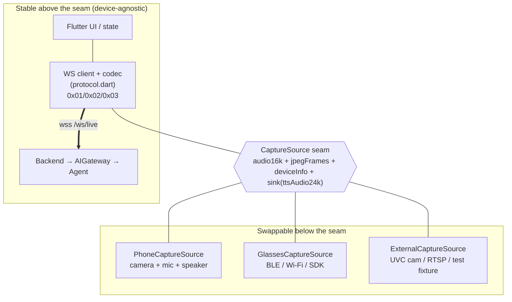
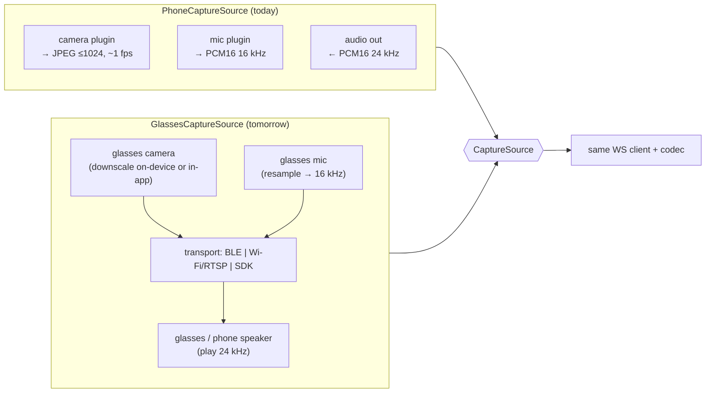
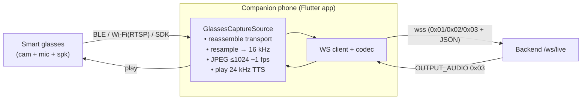

# FarryOn — Universal Device / Smart-Glasses Adapter

> "Phone today, smart glasses tomorrow." This is the seam that makes the rest of
> the system **not care** what is capturing the audio and video — the
> `CaptureSource` abstraction. Wire contract: [`PROTOCOL.md`](../PROTOCOL.md).
> System context: [`ARCHITECTURE.md`](./ARCHITECTURE.md) §2.7.

---

## 1. The idea

Everything above the capture layer — the WebSocket client, the codec, the
backend, the AI gateway — speaks **one fixed contract**: PCM16 @ 16 kHz audio in,
JPEG ~1 fps video in, PCM16 @ 24 kHz audio out, plus the `/ws/live` JSON/binary
messages. So the *only* thing a new device must do is **produce/consume those
streams**. We capture that as a single interface, `CaptureSource`.



The seam is **in the Flutter app** (`mobile/`): the app adapts whatever device to
the protocol, then talks to the backend. The backend therefore sees an identical
stream regardless of device, and only reads the `device` block in `hello` for
telemetry/policy — it never branches on hardware.

---

## 2. The `CaptureSource` abstraction

A `CaptureSource` provides two **input** streams (to send upstream), a way to
**play** the downstream TTS, and **device info** for the `hello` handshake.

```dart
/// The single seam every capture device implements. The WS client consumes
/// `audio16k` + `jpegFrames`, encodes them as 0x01 / 0x02 binary frames, and
/// routes incoming 0x03 OUTPUT_AUDIO into `playTtsAudio`.
abstract interface class CaptureSource {
  /// Static description of the device, surfaced in the `hello` message.
  DeviceInfo get info;

  /// Mic audio: PCM signed-16 LE, 16 kHz, mono, in ~20–100 ms chunks.
  /// (Matches INPUT_AUDIO / 0x01 — PROTOCOL.md §2, §8.)
  Stream<Uint8List> get audio16k;

  /// Camera frames: JPEG, ~1 fps, downscaled to ≤ 1024 px.
  /// (Matches INPUT_VIDEO / 0x02.)
  Stream<Uint8List> get jpegFrames;

  /// Play one chunk of assistant TTS: PCM signed-16 LE, 24 kHz, mono.
  /// (Matches OUTPUT_AUDIO / 0x03.) Implementations resample to their
  /// hardware output rate as needed.
  Future<void> playTtsAudio(Uint8List pcm24k);

  /// Stop playback immediately (barge-in: client sends `interrupt`,
  /// PROTOCOL.md §3 — see ARCHITECTURE.md §5).
  Future<void> stopPlayback();

  /// Acquire hardware / permissions / transport. Idempotent.
  Future<void> start();

  /// Release hardware / transport.
  Future<void> dispose();
}

/// Mirrors the `device` block of the `hello` message (PROTOCOL.md §3).
class DeviceInfo {
  final String kind;            // "phone" | "glasses" | "external"
  final String id;              // stable device id
  final List<String> capabilities; // e.g. ["audio_in","video_in","audio_out"]
  const DeviceInfo({required this.kind, required this.id,
                    required this.capabilities});
}
```

### 2.1 Contract obligations

Whatever the hardware, a conforming `CaptureSource` MUST:

- Emit `audio16k` as **PCM16 LE, 16 kHz, mono**, in ~20–100 ms chunks. If the
  device captures at another rate (e.g. 48 kHz), **resample to 16 kHz** before
  yielding.
- Emit `jpegFrames` as **JPEG, ~1 fps, ≤ 1024 px**. Throttle/downscale at the
  source — don't flood the socket.
- Accept `playTtsAudio` chunks as **PCM16 LE, 24 kHz, mono** and route them to
  the speaker/buds (resampling to hardware rate if needed).
- Honor `stopPlayback()` promptly for barge-in.
- Populate `DeviceInfo` truthfully so the `hello.device.capabilities` advertise
  what the device can actually do (a display-less glasses pendant might omit
  `video_in`, an audio-only puck omits it entirely, etc.).

The seam **decouples conversion from transport**: the source guarantees the wire
formats; how the bytes physically arrive (on-SoC, BLE, Wi-Fi) is the
implementation's problem (§4).

---

## 3. Phone vs glasses implementations



### 3.1 `PhoneCaptureSource` (shipping today)

- **Camera:** the platform camera plugin produces frames; the source JPEG-encodes
  and downscales to ≤ 1024 px and throttles to ~1 fps.
- **Mic:** the platform audio plugin captures PCM; resample to 16 kHz mono and
  chunk to ~20–100 ms.
- **Speaker:** a low-latency PCM player consumes 24 kHz OUTPUT_AUDIO via a jitter
  buffer; `stopPlayback()` flushes it for barge-in.
- **Transport:** none — everything is on-device; the WS client runs in the same
  app process.
- `DeviceInfo{ kind:"phone", capabilities:["audio_in","video_in","audio_out"] }`.

### 3.2 `GlassesCaptureSource` (tomorrow)

Glasses split capture (on the glasses) from connectivity (often via a companion
phone). The source's job is to **pull frames/audio off the glasses, normalize to
the wire formats, and push TTS back** — then hand identical streams to the same
WS client. The phone frequently acts as a **relay**: glasses ⇄ phone (BLE/Wi-Fi)
and phone ⇄ backend (`wss`).

- **Capture:** glasses camera + mic over the chosen transport (§4). Downscale/
  resample either on-device (preferred, saves bandwidth) or in the app.
- **Playback:** route 24 kHz TTS to the glasses speaker/bone-conduction (or fall
  back to the phone/buds if the glasses lack `audio_out`).
- **Capabilities vary:** display-less audio glasses may advertise
  `["audio_in","audio_out"]` only (no `video_in`); the assistant then operates
  voice-only and the SYSTEM prompt's vision behavior simply doesn't trigger.
- `DeviceInfo{ kind:"glasses", id:<glasses serial>, capabilities:[…] }`.

Because the glasses source emits the **same** 16 kHz / JPEG / 24 kHz streams,
**nothing above the seam changes** — UI, codec, backend, gateway, and prompts are
untouched.

---

## 4. Transport options for glasses

The transport is *below* the seam — it only has to deliver bytes that the source
turns into the contract formats. Trade-offs:

| Transport            | What it carries                         | Pros                                              | Cons / caveats                                                         |
| -------------------- | --------------------------------------- | ------------------------------------------------- | --------------------------------------------------------------------- |
| **BLE (GATT)**       | mic audio + low-rate JPEG via companion phone | Ubiquitous, low power, pairs easily               | **Bandwidth-limited** — fine for 16 kHz audio + ~1 fps small JPEGs, tight for more. Needs chunking/reassembly + flow control. |
| **Wi-Fi / RTSP/RTP** | higher-rate A/V stream from glasses      | Plenty of bandwidth; standard A/V stacks (RTSP/RTP, WebRTC) | More power; pairing/setup; the app must **transcode** RTSP/RTP → 16 kHz PCM + JPEG ~1 fps. |
| **Companion SDK**    | vendor-provided frame/audio callbacks    | Vendor handles pairing, codecs, battery; cleanest API | Proprietary, per-vendor; the SDK output must be adapted to the contract formats. |
| **USB / UVC**        | wired A/V (dev rigs, external cameras)   | Reliable, high bandwidth, no pairing              | Tethered; mostly for `external` devices / testing.                    |



**Guidance:** start with the **companion-SDK** path if the vendor offers one
(least glue), fall back to **BLE** for audio-first + sparse frames, and use
**Wi-Fi/RTSP** when you need richer video. In every case the heavy lifting
(reassembly, resample, downscale, jitter-buffered playback) lives in the
`GlassesCaptureSource` so the wire stays identical.

---

## 5. Adding a new device — checklist

To onboard new hardware, you only touch **below the seam** (a new
`CaptureSource`); the WS client, backend, gateway, and prompts are untouched.

1. **Implement `CaptureSource`** for the device (`PhoneCaptureSource` is the
   reference). Wire up `start()` / `dispose()` for hardware + transport lifecycle.
2. **Produce `audio16k`:** capture mic → resample to **16 kHz PCM16 mono** →
   chunk to ~20–100 ms. Verify the rate; the backend assumes 16 kHz.
3. **Produce `jpegFrames`:** capture camera → **JPEG, ≤ 1024 px, ~1 fps**.
   Downscale/throttle at the source. (Omit if the device has no camera.)
4. **Consume TTS:** implement `playTtsAudio` for **24 kHz PCM16** with a jitter
   buffer, and `stopPlayback()` for barge-in.
5. **Fill `DeviceInfo`:** set `kind` (`phone|glasses|external`), a stable `id`,
   and **accurate `capabilities`** — they populate `hello.device`
   (`PROTOCOL.md` §3) and let the assistant adapt (e.g. voice-only when there's no
   `video_in`).
6. **Pick a transport** (§4) and keep all reassembly/transcoding inside the
   source — do **not** leak device formats above the seam.
7. **Register/select** the source in the app's capture factory (e.g. choose by
   paired-device type), so the rest of the app receives a `CaptureSource` and
   nothing else changes.
8. **Test against the contract:** confirm 16 kHz in / JPEG ≤1024 ~1 fps in /
   24 kHz out, barge-in stops playback promptly, and a full turn round-trips
   (compare to [`DATA_FLOW.md`](./DATA_FLOW.md)). The backend `mock` provider is
   handy here — no API keys, deterministic.

If all eight hold, the device "just works" with the entire FarryOn stack —
because to everything above the seam, it's indistinguishable from the phone.

---

## 6. Why the seam is in the app (not the backend)

Format conversion (resampling, JPEG encoding, jitter buffering) is **device- and
OS-specific** and is cheapest **at the source**, before bytes ever hit the
network. Putting the seam in the Flutter app means:

- The **wire protocol stays minimal and fixed** (`PROTOCOL.md`) — the backend
  never needs per-device codecs.
- New devices ship as **client-side** work; the server, gateway, agent, and
  prompts are frozen against the contract.
- Bandwidth is spent on **already-normalized** streams (16 kHz / sparse JPEG),
  not raw high-rate device output.

The backend's only device awareness is reading `hello.device` for telemetry and
optional policy (e.g. capability-gating) — never for media handling.
